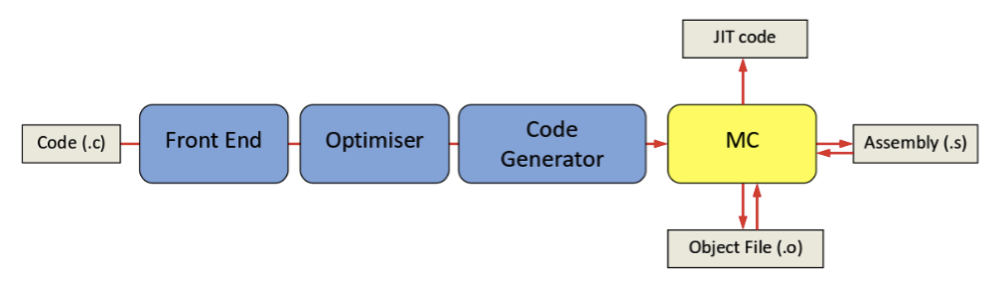

# Capstone vs llvm

* capstone源自`LLVM`编译器框架中的**MC模块**
  * `MC`模块中有个反汇编引擎叫做`MCDisassembler`
    * `MC`=`Machine Code`
    * 机制：
      * 
  * 而`llvm`甚至还有个工具叫做：`llvm-mc`
    * 可以用于反汇编输入的二进制文件
* `capstone`才用了`MCDisassembler`作为核心内容
  * 但又经过了大量优化改动，以适配自己的设计
  * `capstone`在`MCDisassembler`在基础上加了其他的大量的功能
    * ->`MCDisassembler`能做的`capstone`都能做
* `capstone`和`llvm-mc`的区别
  * 详见
    * https://www.capstone-engine.org/beyond_llvm.html
