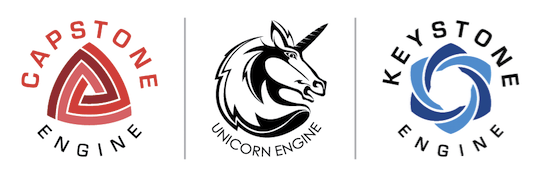
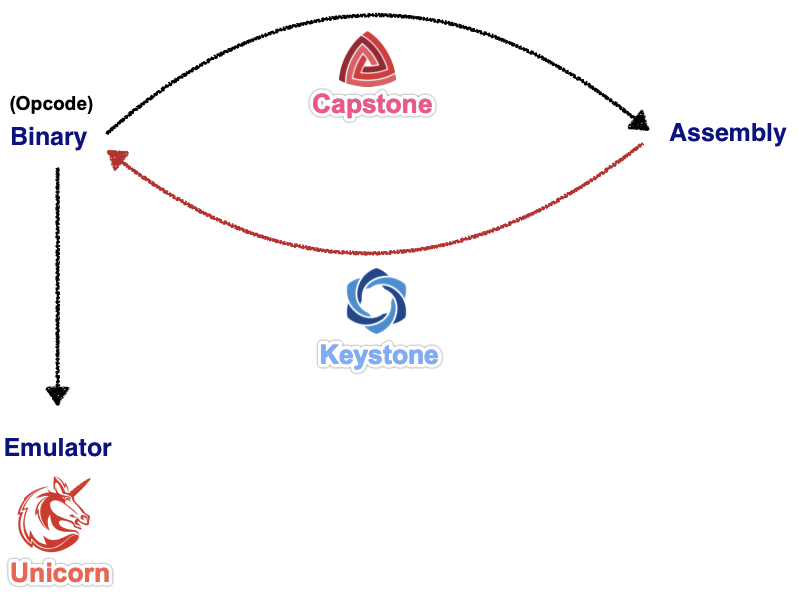
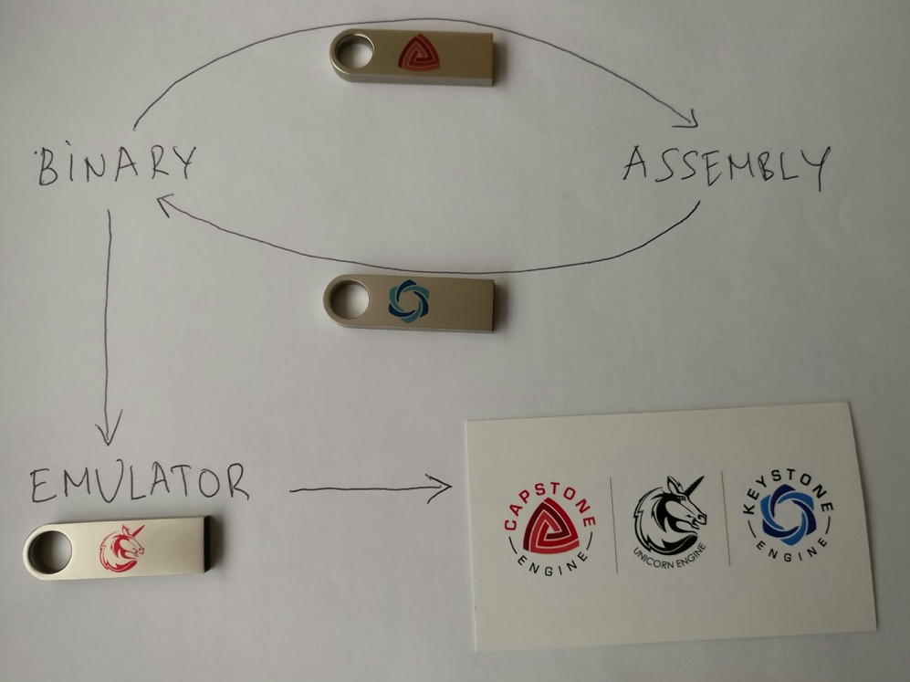
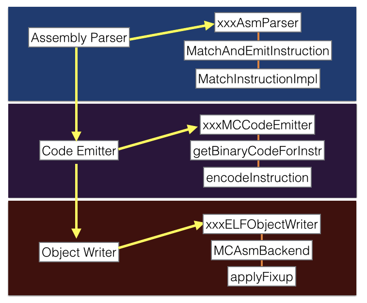
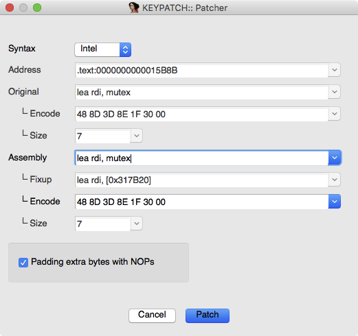

# 三件套：Capstone+Unicorn+Keystone

* 三件套：Capstone+Unicorn+Keystone
  * Logo
    * 
  * 关系
    * Fundamental frameworks for Reverse Engineering
      * 
    * 
  * 3个项目
    * `Capstone disassembler`
      * Next Generation Disassembler Engine
        * http://capstone-engine.org
    * `Unicorn emulator`
      * Next Generation CPU Emulator
        * http://unicorn-engine.org
    * `Keystone assembler`
      * http://keystone-engine.org
      * 流程
        * 
      * IDA插件
        * Keypatch – Keystone – The Ultimate Assembler
          * https://www.keystone-engine.org/keypatch/
            * 
      * 竞品
        * `Radare2`
          * Unix-like reverse engineering framework and commandline tools
        * `Pwnypack`
          * CTF toolkit with Shellcode generator Ropper: Rop gadget and binary information tool
        * `GEF`
          * GDB plugin with enhanced features
        * `Usercorn`
          * Versatile kernel+system+userspace emulator
        * `X64dbg`
          * An open-source x64/x32 debugger for windows
        * `Liberation`
          * code injection library for iOS
        * `Demovfuscator`
          * Deobfuscator for movfuscated binaries
