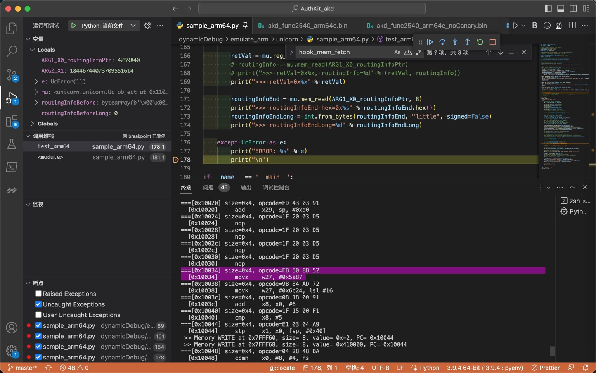

# Unicorn中Capstone使用心得

## Unicorn真正执行代码 和 Capstone反编译显示的代码 未必完全一样

Capstone反汇编出来的指令，有些细节和Xcode中不太一样

* 即，用Capstone去反汇编看到的指令，和Unicorn真正执行的指令，未必相同
  * 但是还是可以供参考的，基本上差距不大

### mov vs movz

* Unicorn底层真正执行的指令 == Xcode反汇编看到的指令：`mov`

```asm
akd`___lldb_unnamed_symbol2540$$akd:
...
    0x1050319c0 <+52>:    mov    w27, #0x5a87
```


* Capstone反编译出的指令：`movz`

```asm
===[0x10034] size=0x4, opcode=FB 50 8B 52 
  [0x10034]     movz    w27, #0x5a87
```



—> 经过确认，其实：是一样的。

细节是：

* `MOV (wide immediate)`
  * 概述
    * Move 16-bit immediate to register.
    * This instruction is an alias of MOVZ.
  * 语法
    * `MOV Wd, #imm`
    * `MOV Xd, #imm`
  * 解释
* `MOVZ`
  * 概述
    * Move shifted 16-bit immediate to register.
    * This instruction is used by the alias MOV (wide immediate).
  * 语法
    * `MOVZ Wd, #imm{, LSL #shift}`
    * `MOVZ Xd, #imm{, LSL #shift}`
* 对比
  * 要移动的立即数imm：
    * `MOV (wide immediate)`
      * 有2种
        * 对于32位的`Wd`：`32位`
        * 对于64位的`Xd`：`64位`
      * -》和MOVZ的16bit比，32位和64位位数**更宽**，所以叫做`wide immediate`
    * `MOVZ`
      * 16位（无符号的立即数）
  * -》而当MOVZ中`shift=0`时，且`imm的值 <=65536` 即`16位`时：
    * `MOV (wide immediate)` == `MOVZ`
      * 举例：当`imm=0x5a87`，多种写法，代码逻辑是一样的
        * `mov w27, #0x5a87`
        * `mov x27, #0x5a87`
        * `movz w27, #0x5a87`
        * `movz x27, #0x5a87`

### 有些值是计算后的值，而不是指令本身的值 

概述：有些值是计算后的值，而不是指令本身的值

#### 举例1：`adr x25, #0x227e4` vs `adr x25, #0x32850`

Unicorn调试期间，如果也是像我：用到Capstone去，查看当前反汇编后的ARM汇编代码

尤其要注意，对于`adr`等指令，其显示出的值：是**计算后**的值，而不是**原始**的值

比如：

原始ARM汇编指令是：

```asm
adr    x25, #0x227e4
```

而经过`Capstone`去反汇编出来的，却是：

```asm
adr     x25, #0x32850
```

其中的，加上当前PC的值，完整的log是：

```asm
0x0001006C  <+108>: 39 3F 11 10  -> adr     x25, #0x32850
```

可以看出：

* `x25` = `0x32850` = `当前PC` + 指令中的**原始**的偏移量 = `0x0001006C + 0x227e4`

-》否则，不小心就搞错了，以为是：

* `x25` = `0x428BC` = `当前PC` + 指令中的原始的偏移量 = `0x0001006C + 0x32850`

#### 举例2：`LDR x8 #0x5F1EC` vs `LDR x8 #0x6F214`

* 二进制=opcode：`68 8F 2F 58`
  * 条件
    * ARM的little endian 小端
    * ARM64模式
  * 用
    * Xcode
    * 自己手动解码
    * Unicorn
    * Capstone
  * 正常解码出是
    * `LDR x8 #0x5F1EC`
  * 只不过：Unicorn/Capstone，会去继续处理：
    * 根据此处LDR (literal) == LDR (PC-relative literal)的本意：
      * `具体要加载的值` = `offset + PC的值` = `0x5F1EC` + `当前PC值是0x10028 `= `0x6F214`
  * 所以，而是，Unicorn/Capstone中，显示出来的是解码后 + 解析后，最终的结果：
    * `LDR x8 #0x6F214`
  * 以为是解码错误，实际上是：解码正确的
    * 只是显示逻辑上，略有不同而已
